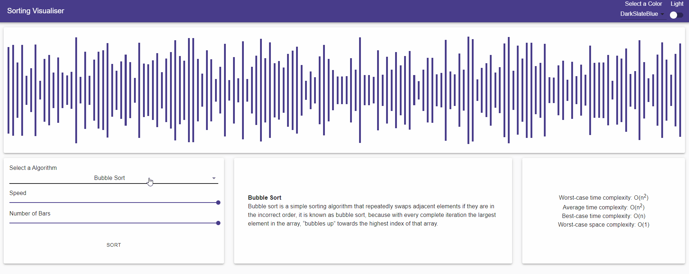

# Sorting-Vis
[Sorting-Vis](https://gzh2003.github.io/sorting-vis/) is a visualision tool I built with some classmates as part of our grade 12 computer science class.

## Features

### Algorithms
This sorting visualiser currently supports the following algorithms:

1. Bubble Sort

2. Selection Sort

3. Insertion Sort

4. Merge Sort

5. Quick Sort

### Miscellaneous
It also features:

1. adjustable array sizes
2. adjustaable iteration speeds
3. different color themes